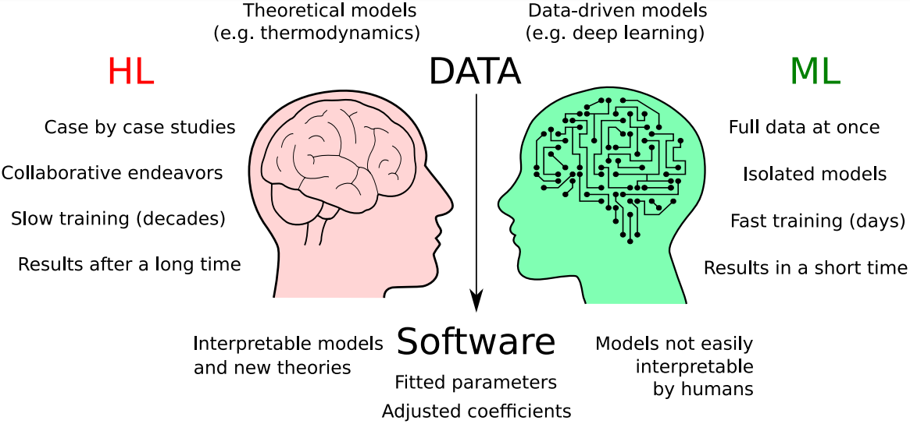

# Machine learning versus human learning
This repository contains the source code and data for reproducibility of:

"Machine learning versus human learning: homology and cross-validation in bioinformatics", by L.A. Bugnon, L.E. Di Persia, M. Gerard, J. Raad, E. Fenoy, S. Prochetto, A. Edera, G. Stegmayer, D.H. Milone

This comment provides a novel perspective of the way humans and machines learn from data to build computational models, and how it impacts the design of bench-marks and validation strategies in bioinformatics.

The main results analysis can be seen in [this notebook](results.ipynb).  